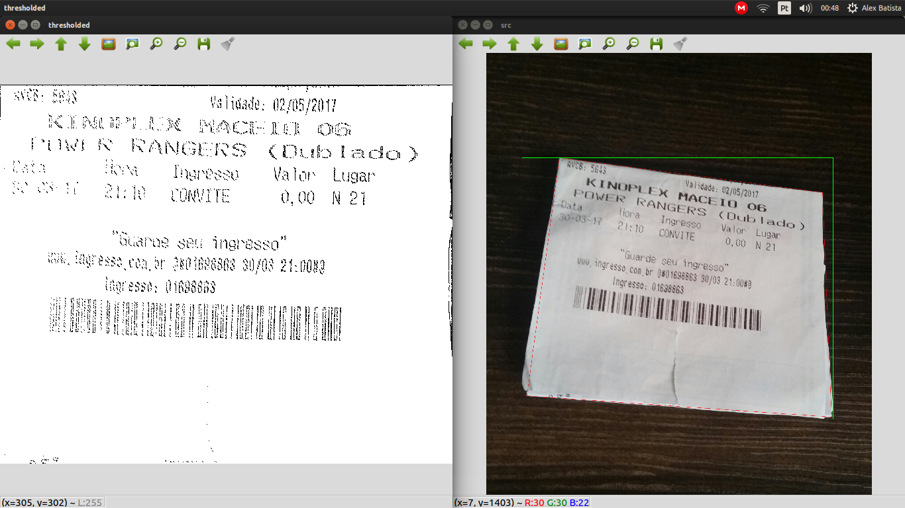
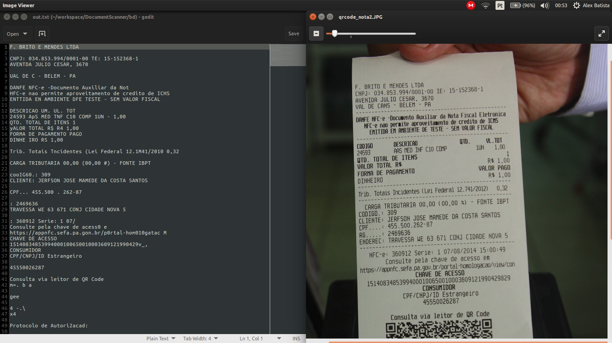
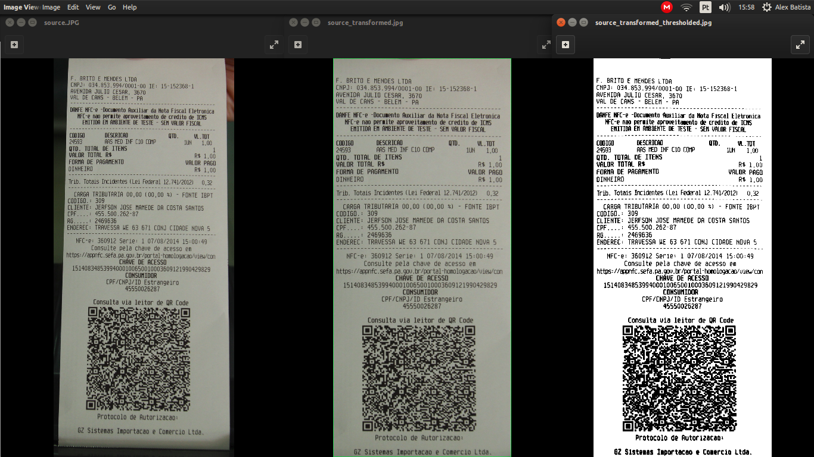

# DocumentScanner
### Computer Vision Project - UFAL 2016.2
***
##### Esta é uma descrição referente aos avanços da segunda semana de atividades.

Os arquivos atualmente neste projeto são os seguintes:
***canny_homography_example.cpp***
 -- *Neste exemplo, uma imagem de entrada passa por um processo de detecção de borda através do "Canny Detector" e então passa por um processo de homografia e limiarização*
 
***threshold_homography_example.cpp***
-- *Neste exemplo, uma imagem de entrada passa por um processo de detecção de borda através do cálculo de um threshold. Então, a imagem passa igualmente por um processo de homografia e limiarização.*

***edge_detector.cpp***
-- *Neste exemplo, utiliza-se novamente o Detector Canny para identificação de borda. O threshold pode ser especificado manualmente pelo usuário através de um slider na janela da imagem.*

Os três exemplos já vem compilados, para executar:
```sh
$ ./threshold_homography_example <path_to_image>/img.jpg
```
Exemplo da imagem de saída:


O projeto também já inclui um ***CMakeList.txt*** para geração do makefile adequado. Edite o arquivo ***CMakeList.txt*** conforme sua necessidade então, execute o seguinte comando:
```sh
$ cmake CMakeList.txt
```
e em seguida basta executar o comando make:
```sh
$ make
```
Com isso, o executável será gerado.

***UPDATE***

Inclusão do OCR parcialmente concluída. Tesseract já executando


*Ainda com alguns problemas na integração com o código anterior. Correção em andamento*

***UPDATE2***

OCR já integrado com o código do projeto.

*Imagem passada via parâmetro*

**Saída disponível no arquivo output.txt**
